# FFmpeg多媒体框架开发Demo

[toc]

---

## 1、说明

|     类名      | 功能                                                         |
| :-----------: | ------------------------------------------------------------ |
|   VideoPlay   | 使用ffmpeg音视频库【软解码】实现的视频播放器；               |
| VideoPlayGL1  | 使用ffmpeg音视频库【软解码 + OpenGL显示RGB图像】实现的视频播放器； |
| VideoPlayGL2  | 使用ffmpeg音视频库【软解码 + OpenGL显示YUV图像】实现的视频播放器； |
|  VideoPlayHW  | 使用ffmpeg音视频库【硬解码】实现的视频播放器；               |
| VideoPlayHWGL | 使用ffmpeg音视频库【软/硬解码 + OpenGL显示YUV/NV12】实现的视频播放器； |
| VideoCamera1  | FFmpeg打开本地摄像头简单示例（软解码+OpenGL）；              |
| VideoCamera2  | 使用ffmpeg音视频库【软解码】打开本地摄像头【录制视频】保存到本地示例； |
| VideoCamera3  | FFmpeg音视频库打开本地摄像头，并直接显示获取的YUYV422原始图像，【不需要解码】； |
|  AVIOReading  | API示例程序，演示如何从通过AVIOContext访问的自定义缓冲区读取数据； |
|  DecodeAudio  | 使用libavcodec API的音频解码示例（MP3转pcm）；               |
|   Screencap   | FFmpeg实现录屏功能                                           |
| VideoPlaySave | 使用软解码实现的视频播放器，并将H264裸流保存到视频文件中（无需编码） |

 

## 2、相关博客

|                           相关博客                           |
| :----------------------------------------------------------: |
| 👉[CSDN](https://blog.csdn.net/qq_43627907/category_11660518.html)👈 |

## 3、构建说明

* 下载当前源码后如果直接编译则会显示无法编译或者报错；
* 这是因为当前工程下的所有子项目都依赖于FFmpeg库，如果没有设置FFmpeg库的路径则无法编译；
* 打开FFmpegDemo.pro文件，将变量【ffmpegPath】设置为你自己的ffmpeg库的路径就可以编译了；
* 但是你这时编译会发现会报错，这是因为每一个子项目中都需要修改ffmpeg库的路径；
  * 有些子项目的库路径设置位于pro文件中，例如AVIOReading；
  * 有些子项目的库路径设置位于项目的子模块pri文件中，例如VideoPlay。

## 4、实现效果

### 1.1 VideoPlay

> 1. 使用ffmpeg音视频库【软解码】实现的视频播放器；
> 2. 支持打开本地视频文件（如mp4、mov、avi等）、网络视频流（rtsp、rtmp、http等）；
> 3. 支持视频【匀速播放】；
> 4. 采用QPainter进行显示，支持【自适应】窗口缩放；
> 5. 视频播放支持实时【开始/关闭、暂停/继续】播放；
> 6. 视频解码、线程控制、显示各部分功能分离，【低耦合度】。
> 7. 采用最新的【5.1.2版本】ffmpeg库进行开发，【超详细注释信息】，将所有踩过的坑、解决办法、注意事项都得很写清楚。

* 这里上传的gif图片经过压缩，效果较差，实际为高清

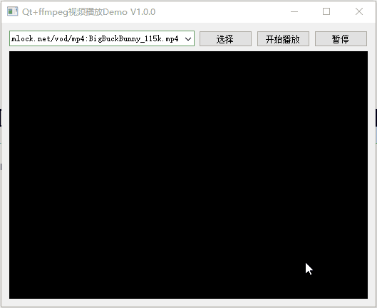

### 1.2 VideoPlayGL1

> 1. 使用ffmpeg音视频库【软解码】实现的视频播放器；                                    
> 2.  支持打开本地视频文件（如mp4、mov、avi等）、网络视频流（rtsp、rtmp、http等）；           
> 3.   支持视频匀速播放；                                                   
> 4.   采用【OpenGL显示RGB】图像，支持自适应窗口缩放，支持使用QOpenGLWidget、QOpenGLWindow显示；
> 5.   视频播放支持实时开始/关闭、暂停/继续播放；                                      
> 6.   视频解码、线程控制、显示各部分功能分离，低耦合度。                                   
> 7.   采用最新的5.1.2版本ffmpeg库进行开发，超详细注释信息，将所有踩过的坑、解决办法、注意事项都得很写清楚。    
> 

* 下图中使用OpenGL显示RGB图像CPU占用率是使用QPainter显示的<mark>一半</mark>，由于我使用的是非常老的笔记本的集显测试，所以GPU占用率比较高。

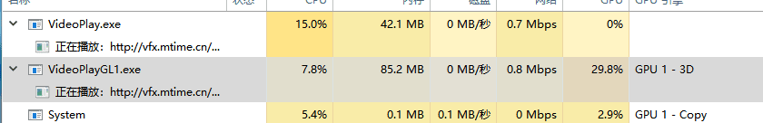

### 1.3 VideoPlayGL2

> 1. 使用ffmpeg音视频库【软解码】实现的视频播放器；                                
> 2. 支持打开本地视频文件（如mp4、mov、avi等）、网络视频流（rtsp、rtmp、http等）；       
> 3. 支持视频匀速播放；                                               
> 4. 采用【OpenGL显示YUV】图像，支持自适应窗口缩放，支持使用QOpenGLWidget、QOpenGLWindow显示；
> 5. 将YUV转RGB的步骤由CPU转换改为使用GPU转换，降低CPU占用率；
> 6. 视频播放支持实时开始/关闭、暂停/继续播放；                                  
> 7. 视频解码、线程控制、显示各部分功能分离，低耦合度。                               
> 8. 采用最新的5.1.2版本ffmpeg库进行开发，超详细注释信息，将所有踩过的坑、解决办法、注意事项都得很写清楚。
> 

* 下图中使用OpenGL显示YUV图像CPU占用率是使用QPainter显示的<mark>1/3左右</mark>，由于我使用的是非常老的笔记本的集显测试，所以GPU占用率比较高。

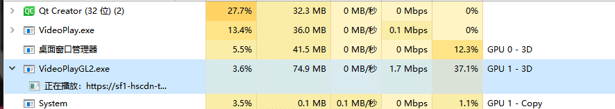

### 1.4 VideoPlayHW

> 1. 使用ffmpeg音视频库【硬解码】实现的视频播放器，采用GPU解码， 大幅降低对CPU的暂用率；
> 2. 支持打开本地视频文件（如mp4、mov、avi等）、网络视频流（rtsp、rtmp、http等）；
> 3. 支持视频匀速播放；
> 4. 采用QPainter进行显示，支持自适应窗口缩放；
> 5. 视频播放支持实时开始/关闭、暂停/继续播放；
> 6. 视频解码、线程控制、显示各部分功能分离，低耦合度。
> 7. 采用最新的5.1.2版本ffmpeg库进行开发，超详细注释信息，将所有踩过的坑、解决办法、注意事项都得很写清楚；
> 8. 展示了9路视频播放。

* 由于测试的电脑硬件性能过低，所以看起来效果不是很明显

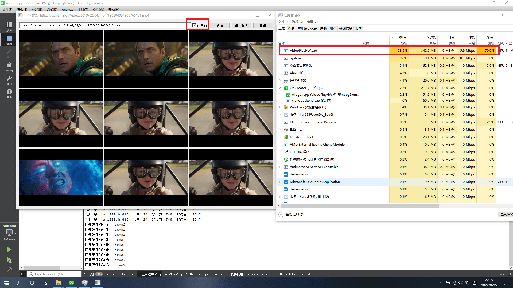

### 1.5 VideoPlayHWGL

> 1. 使用ffmpeg音视频库【软/硬解码】实现的视频播放器；                                           
> 2. 支持打开本地视频文件（如mp4、mov、avi等）、网络视频流（rtsp、rtmp、http等）；                    
> 3. 支持视频匀速播放；                                                            
> 4. 采用【OpenGL显示YUV、NV12】图像，支持自适应窗口缩放，支持使用QOpenGLWidget、QOpenGLWindow显示；  
> 5. 将YUV/NV12转RGB的步骤由CPU转换改为使用GPU转换，降低CPU占用率；                            
> 6. 使用<mark>av_hwframe_map</mark>替代<mark>av_hwframe_transfer_data</mark>，可将【耗时降低1/3】；              
> 7. 视频播放支持实时开始/关闭、暂停/继续播放；                                               
> 8. 视频解码、线程控制、显示各部分功能分离，低耦合度。                                            
> 9. 采用最新的【5.1.2版本】ffmpeg库进行开发，超详细注释信息，将所有踩过的坑、解决办法、注意事项都得很写清楚。           

* 使用GPU解码 + OpenGL绘制大大降低了CPU占用率

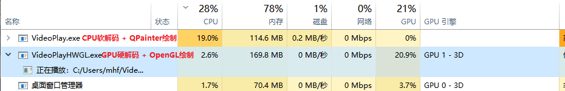

### 1.6 AVIOReading

> 1. 将一个视频文件中说有数据读取到buf中；
> 2. 为AVIOContext创建一个回调函数；
> 3. 创建一个长度为4096内存avio_buf用于从buf中读取数据；
> 4. 使用回调函数完成数据的读取。

* 数据读取示例如下

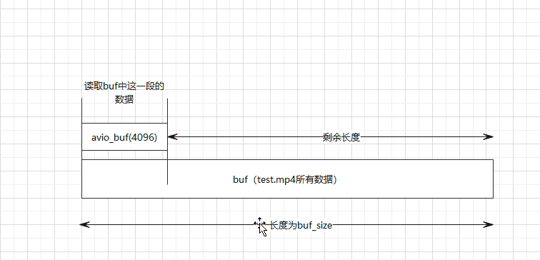

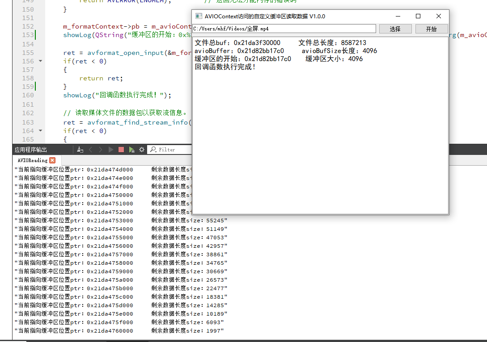

### 1.7 DecodeAudio

> 1. 使用FFmpeg将mp3音频文件解码，并保存为原始音频文件pcm；
> 2. 使用Qt的方式重写了Demo；
> 3. 解决了官方Demo中的部分Bug。

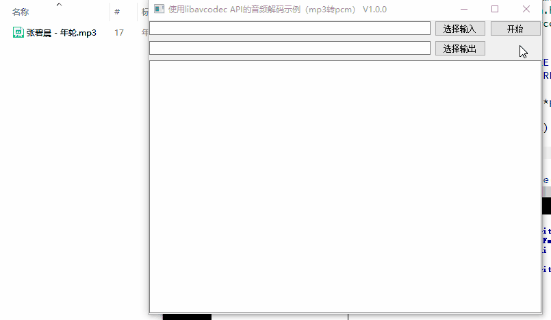

### 1.8 VideoCamera1

> 1. 使用ffmpeg音视频库【软解码】打开【本地摄像头】；                                       
> 2. 采用【OpenGL显示YUV】图像，支持自适应窗口缩放，支持使用QOpenGLWidget、QOpenGLWindow显示；
> 3. 将YUV转RGB的步骤由CPU转换改为使用GPU转换，降低CPU占用率；                          
> 4. 支持Windows、Linux打开本地摄像头；                                        
> 5. 视频解码、线程控制、显示各部分功能分离，低耦合度。                                     
> 6. 采用最新的5.1.2版本ffmpeg库进行开发，超详细注释信息，将所有踩过的坑、解决办法、注意事项都得很写清楚。      

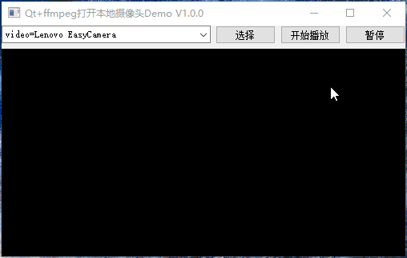

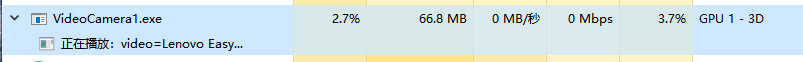

### 1.9 VideoCamera2

> 1. 使用ffmpeg音视频库【软解码】打开本地摄像头【录制视频】保存到本地；                             
> 2. 采用【OpenGL显示YUV】图像，支持自适应窗口缩放，支持使用QOpenGLWidget、QOpenGLWindow显示； 
> 3. 将YUV转RGB的步骤由CPU转换改为使用GPU转换，降低CPU占用率；                           
> 4. 支持Windows、Linux打开本地摄像头；                                        
> 5. 支持使用【静态帧率】、【动态帧率】录制视频；                                         
> 6. 视频解码、线程控制、显示各部分功能分离，低耦合度。                                      
> 7. 采用最新的5.1.2版本ffmpeg库进行开发，超详细注释信息，将所有踩过的坑、解决办法、注意事项都得很写清楚。       

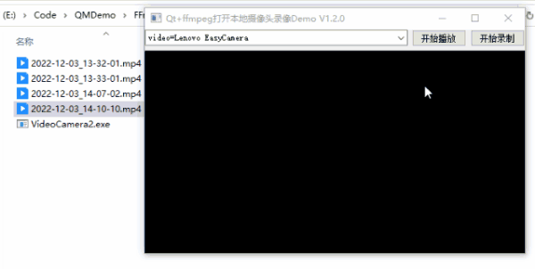

### 1.10 Screencap

> 1. 抓取桌面图像转码后保存到本地视频文件中；           
> 2. 支持各种常见视频文件类型；                  
> 3. 支持Windows、Linux录屏功能；           
> 4. 主要功能分为录屏线程、录屏解码、图像像素转换、编码保存4部分。

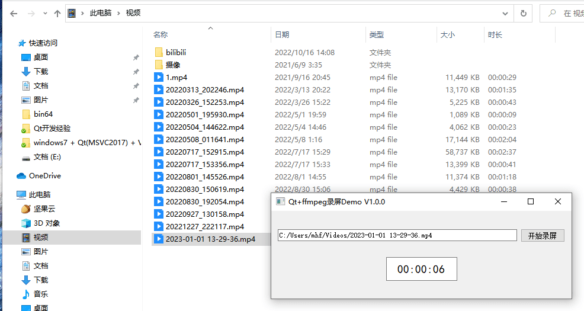

### 1.11 VideoPlaySave

> 1. 视频播放功能与【VideoPlay】相同；
> 2. 在使用ffmpeg打开网络视频流时，如果是h264裸流可以直接保存为本地文件，不需要进行编码操作；
> 3. 由于不需要进行编码，可以大大降低CPU占用率。

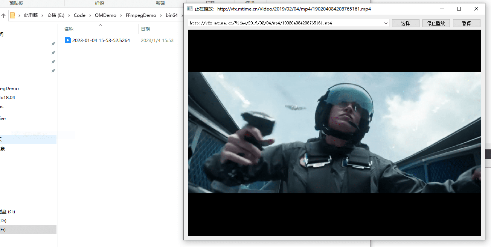

### 1.12 VideoCamera3

> 1. 使用ffmpeg音视频库打开本地摄像头；
> 2. 采用【OpenGL显示YUV】图像，支持自适应窗口缩放，支持使用QOpenGLWidget、QOpenGLWindow显示；
> 3. 打开摄像头后一般情况默认解码器为【rawvideo】，获取的图像像素格式为【YUYV422】，可以【不需要解码】，直接将YUYV422转为YUV420P进行显示；
> 4. 支持Windows、Linux打开本地摄像头；
> 5. 视频解码、线程控制、显示各部分功能分离，低耦合度。
> 6. 采用5.1.2版本ffmpeg库进行开发，超详细注释信息，将所有踩过的坑、解决办法、注意事项都得很写清楚;
> 7. 【注意：】如果打开摄像头失败，需要检测是不是摄像头分辨率设置不正确，解码器如果不是rawvideo则这个程序不执行;
> 8. 由于不同电脑摄像头打开时解码器不同，获取的图像格式不同，所以为了便于显示，在获取图像后统一转换为YUV420P格式进行显示。

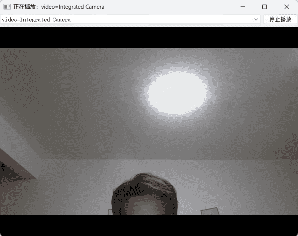
