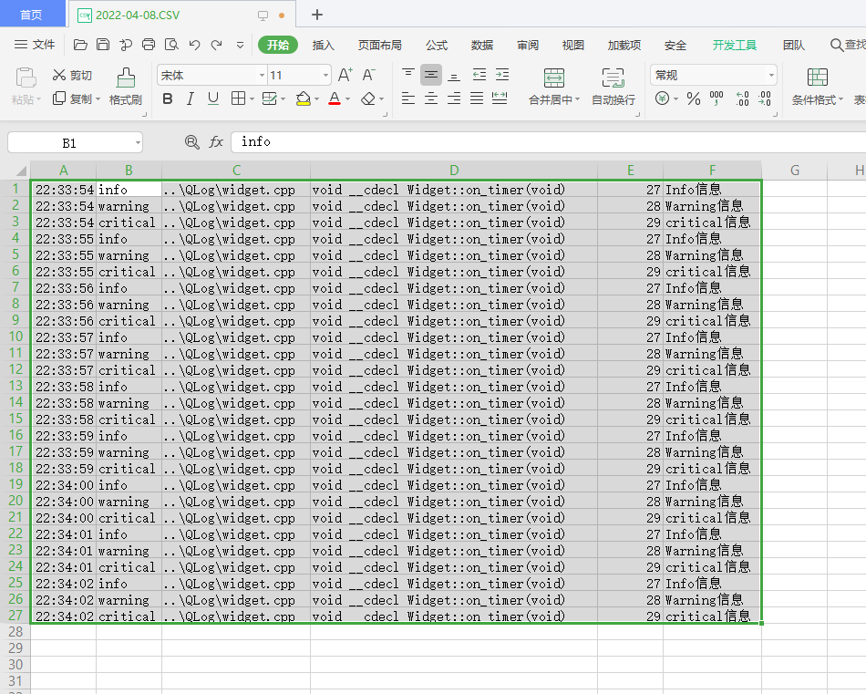
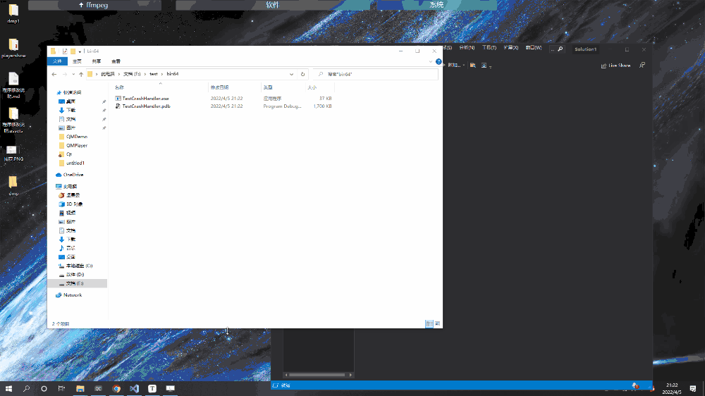
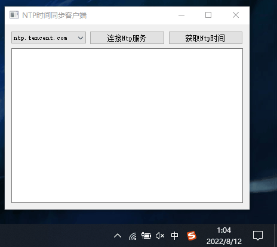
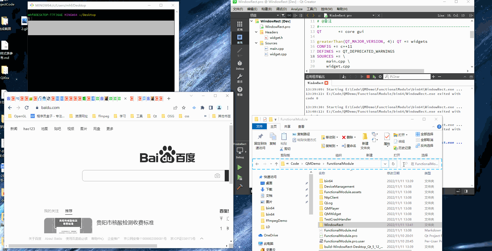
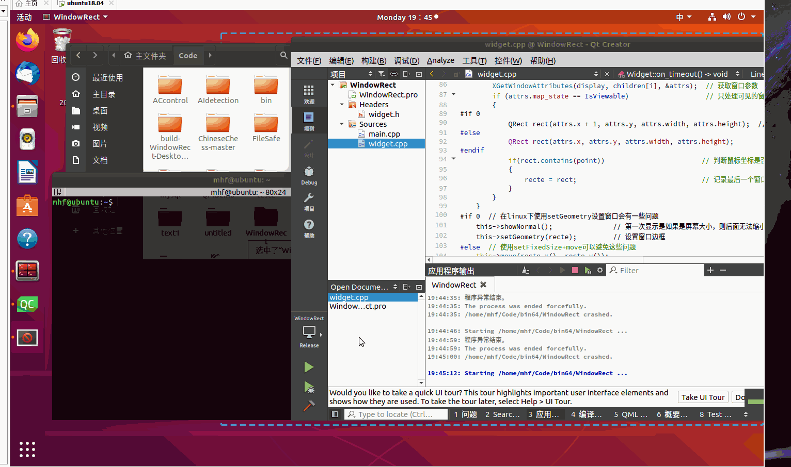
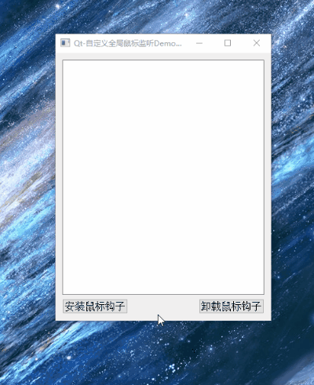
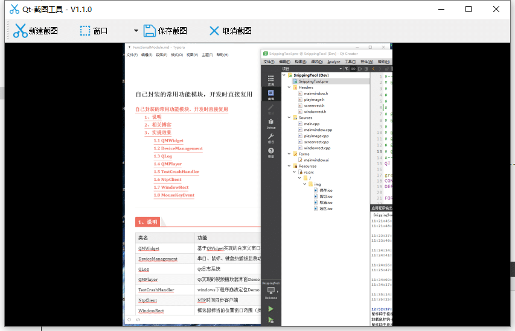

# 自己封装的常用功能模块，开发时直接复用

[toc]

---

## 1、说明

| 类名             | 功能                                     | 支持系统       |
| ---------------- | ---------------------------------------- | -------------- |
| QMWidget         | 基于QWidget实现的自定义窗口模块          | windows        |
| DeviceManagement | 串口、鼠标、键盘热插拔监测功能模块       | windows        |
| QLog             | Qt日志系统                               |                |
| QMPlayer         | Qt实现的视频播放器界面Demo               | windows        |
| TestCrashHandler | windows下程序崩溃定位Demo                | windows        |
| NtpClient        | NTP时间同步客户端                        | Windows、Linux |
| WindowRect       | 框选鼠标当前位置窗口范围（类似窗口截图） | Windows、Linux |
| MouseKeyEvent    | Qt实现自定义全局鼠标键盘事件监听器Demo   | Windows        |
| SnippingTool     | Qt实现截图工具                           | Windows、Linux |

## 2、相关博客

* [CSDN](https://blog.csdn.net/qq_43627907/category_9335696.html?spm=1001.2014.3001.5482)

## 3、实现效果

### 1.1 QMWidget

> 1. 鼠标在标题栏移动窗口
> 2. 双击标题栏最大化、还原
> 3. 窗口移动到屏幕边界实现1/4屏、1/2屏、全屏显示
> 4. 最大化、最小化、退出按键
> 5. 鼠标在窗口边缘，四角拉伸缩放窗口
> 6. 任务栏标题名称设置
> 7. 独立标题栏模块，便于后续扩展

### 1.2 DeviceManagement

> 1. 通过继承**QAbstractNativeEventFilter**接口实现串口热插拔监测功能；
> 2. 通过在QWidget中重写**nativeEvent**实现串口热插拔监测功能；
> 3. 通过一个函数获取系统中所有可用串口名；
> 4. 自动添加、移除可用串口；
> 5. 鼠标、键盘热插拔监测。

### 1.3 QLog

> 1. 可选择日志显示到文本窗口并保存、不显示只保存两种使用方式；
> 2. 选择显示日志级别；
> 3. 可设置不同级别日志显示颜色；
> 4. 支持将日志信息保存到纯文本Log文件中；
> 5. 支持将日志信息保存到纯文本CSV文件中，便于阅读、查找和分类日志信息，可用于将CSV中的日志信息导入数据库；
> 6. 支持按12小时、24小时、按文件大小、日志行数创建新日志文件；
> 7. 无任何第三方依赖，支持任意编译器，任意系统；
> 8. 保留日志存储接口、日志显示接口，便于后续扩展日志存储、显示方式，如存储到数据库等；
> 9. 模块完全基于QDebug，与程序所有功能基本0耦合，非常便于程序开发。

### 1.4 QMPlayer

> 1. 基于QMWidget的自定义窗口；
> 2. 增加侧边栏模块；
> 3. 增加播放控制栏模块，包含播放停止、上一集、下一集、视频时间、音量控制、设置功能按键样式；
> 4. 增加进度条模块，可跳转到鼠标点击位置；
> 5. 通过`QPropertyAnimation`实现侧边栏、进度条、控制栏打开关闭动画效果；
> 6. 实现双击全屏显示、还原效果。

### 1.5 TestCrashHandler

> 1. 通过win api实现qt程序崩溃问题定位功能；
> 2. 只支持**msvc编译器**；
>
> 3. 低耦合模块，**一行代码**直接引用功能，无需添加第三方依赖库；
>
> 4. 根据时间生成dump文件，每次崩溃生成一个文件，避免了覆盖问题；
>
> 5. 程序崩溃时自动生成dmp文件，可通过WinDbg或VS打开dmp文件定位崩溃位置；
>
> 6. 通过宏判断，在MinGW或其他系统环境编译时功能自动失效**不会编译失败**；
>
> 7. 支持release模块下生成dump文件。

### 1.6 NtpClient

> **NTP时间同步客户端程序Demo**
>
> 1. 使用UDP进行通信；
> 2. 毫秒级时间精度；
> 3. 使用多个阿里云NTP时间同步服务器、腾讯云NTP时间同步服务器；
> 4. 支持windows、linux下修改系统时间。
>
> **注意：** 由于设置系统时间的功能比较重要，所以不管是Windows还是Linux都需要最高权限才可以。
>
> 1. Windows下需要【以管理员身份运行】打开QtCreator或者编译后给NtpClient.exe设置权限【属性->兼容性->以管理员身份运行此程序】，否则无法修改系统时间；
> 2. Linux下编译后使用【sudo ./NtpClient】 运行程序。

### 1.7 WindowRect

> 1. 框选鼠标当前位置窗口范围（类似窗口截图）
> 2. 使用WindowsAPI实现windows下功能；     
> 3. 使用x11 API实现linux（ubuntu）下功能。  

* windows

* linux

### 1.8 MouseKeyEvent

Qt自身的鼠标事件、事件过滤器一般当鼠标移出窗口或者遇见鼠标穿透时就不起作用了，这时如果还想要鼠标事件只能自己封装一个全局鼠标事件监听器；

> 1. windows下使用鼠标钩子实现全局鼠标监听功能；
> 2. 通过封装将Windows鼠标信号转换成Qt鼠标信号；
> 3. 键盘事件（待完成）;

* 全局鼠标监听

### 1.9 SnippingTool

* 使用Qt编写的一个截图工具软件，支持Windows、linux系统，无第三方依赖，均使用Qt库或者系统库实现。

> 1. 实现Windows、linux系统下截图功能；  
> 2. 实现全屏截图、矩形截图、窗口截图功能；      
> 3. 实现保存截图、取消截图功能；           
> 4. 使用QPainter实时显示截取的图片；
> 5. 使用自定义全局 鼠标事件监听器解决截图时窗口透明导致的鼠标穿透而无法捕捉到鼠标事件问题。
> 6. Windows下使用user32获取鼠标所在位置窗口大小，Linux下使用x11获取鼠标所在位置窗口大小。

