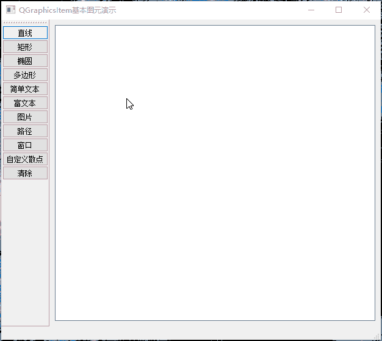

# GraphicsView 图形视图框架Demo

[toc]

---

## 1、说明

| 类名              | 功能                                               |
| ----------------- | -------------------------------------------------- |
| GraphicsItem      | QGraphicsItem基本图元演示                          |

## 2、相关博客

* 

## 3、实现效果

### 1.1 basicdrawing

> 1. 包含内置的 直线、矩形、椭圆、多边形、简单文本、富文本、图片、绘图路径、窗口部件基本图元；
> 2. 实现【自定义散点图元】；
> 3. 实现所有图元鼠标选中、移动功能，包括窗口部件图元；
> 4. 解决自定义图元鼠标移动存在残留问题。

