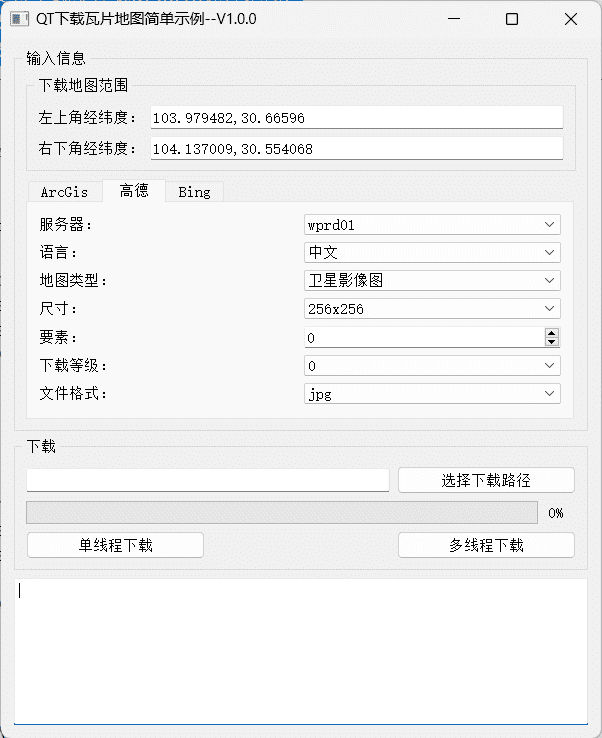
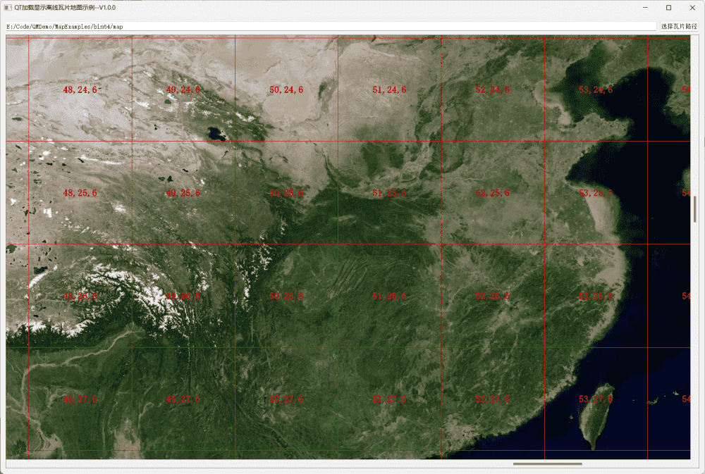
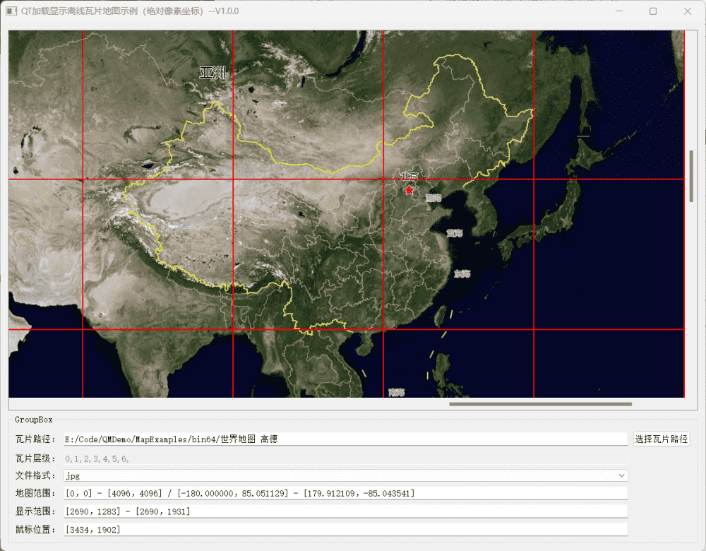
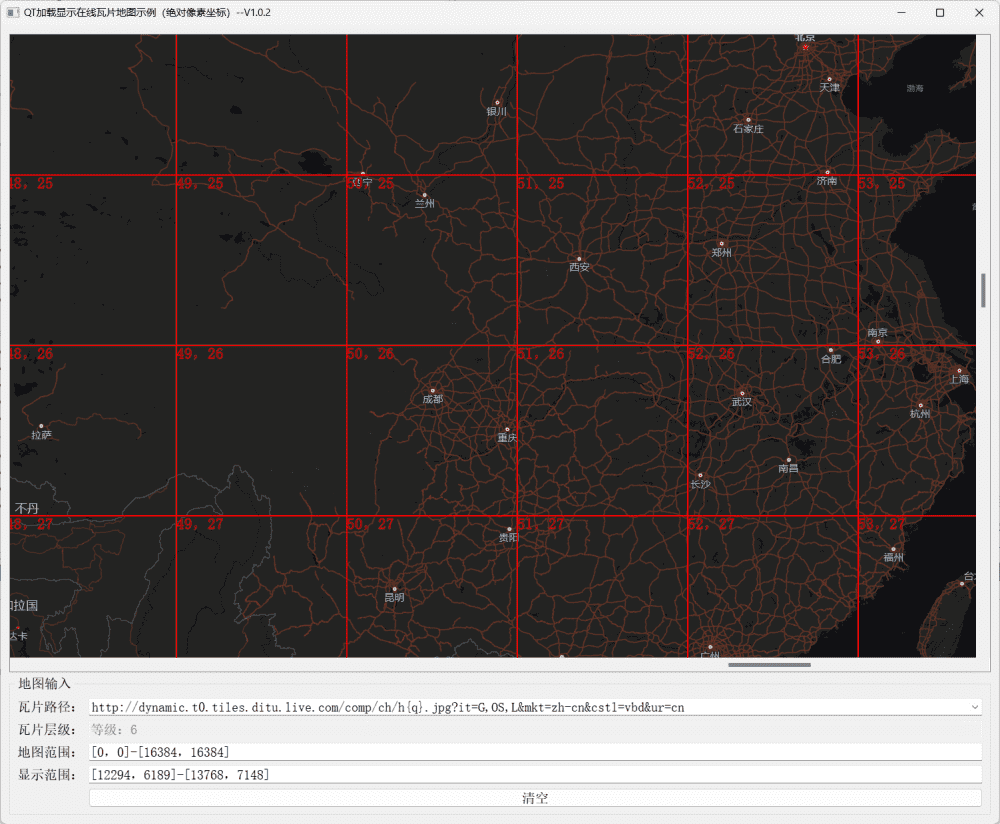

# Qt地图功能开发

[toc]

---

## 1、说明

|    类名     | 功能                                    |
| :---------: | --------------------------------------- |
| MapDownload | QT实现简单的瓦片地图下载示例            |
|   MapView   | Qt使用QGraphicsView显示瓦片地图简单示例 |
|  MapView2   | Qt以绝对像素坐标显示**离线**瓦片地图    |
|  MapView3   | Qt以绝对像素坐标显示**在线**瓦片地图    |


## 2、相关博客

| 相关博客 |
| :------: |
|          |


## 3、构建说明

* 由于瓦片地图下载使用到`QNetworkAccessManager`类，而这个类需要openssl支持；

* qt默认安装是不带openssl的，需要自己配置openssl环境；

* **安装openssl**

  * 使用下列代码打印qt版本支持的ssl版本；

    ```c++
    qDebug() << "输出当前QT支持的openSSL版本: " << QSslSocket::sslLibraryBuildVersionString();
    qDebug() << "OpenSSL支持情况: " <<QSslSocket::supportsSsl();
    qDebug() << "OpenSSL运行时SSL库版本: " << QSslSocket::sslLibraryBuildVersionString();
    ```

  * windows可以[下载](https://slproweb.com/products/Win32OpenSSL.html)对应版本的openssl，然后进行安装；

  * linux可以通过命令行安装，也可以下载源码自己编译。

  * openssl的github[仓库](https://github.com/openssl/openssl)

  * openssl[官网](https://www.openssl.org/)

  * 安装后将openssl/bin文件夹下的libcrypto-1_1-x64.dll、libssl-1_1-x64.dll两个动态库拷贝到qt的编译器路径下，注意区分32和64位

    * D:\Qt\Qt5.14.2\5.14.2\msvc2017_64\bin
    * D:\Qt\Qt5.14.2\5.14.2\mingw73_64\bin

  

## 4、实现效果

### 1.1 MapDownload

> 1. 支持单线程、多线程下载瓦片地图。
> 2. 支持下载多样式arcGis瓦片地图；
> 3. 支持下载多样式高德瓦片地图；
> 4. 支持Bing地图下载。



### 1.2 MapView

> 1. 支持多线程加载显示本地离线瓦片地图(墨卡托投影)；
> 2. 瓦片切片规则以左上角为原点（谷歌、高德、ArcGis等），不支持百度瓦片规则
> 3. 支持显示瓦片网格、编号信息；
> 4. 以QGraphicsView坐标系绘制瓦片地图。



### 1.2 MapView2

> 1. 加载显示本地离线瓦片；
> 2. 使用**绝对像素坐标**方式显示瓦片；
> 3. 支持以**鼠标为原点缩放**瓦片层级；
> 4. 支持在线程池中快速加载本地瓦片；
> 5. 为了示例更加简单，复杂功能没在这个示例实现，会加载当前层级所有瓦片。




### 1.3MapView3

> 1. 加载显示在线瓦片地图；
> 2. 支持以鼠标为原点缩放瓦片层级；
> 3. 使用绝对像素坐标方式显示瓦片；
> 4. 支持在线程池中快速下载在线瓦片；
> 5. 支持鼠标缩放地图层级；
> 6. 支持显示瓦片编号、瓦片网格；
> 7. 默认支持下载显示多格式高德、Bing、ArcGis瓦片地图。


