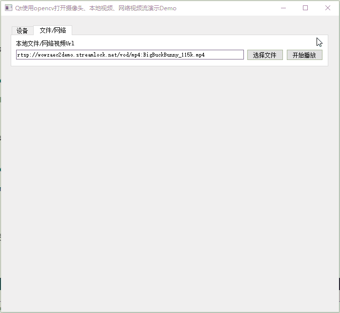

# Qt使用OpenCV进行视频、图像操作Demo

[toc]

---

## 1、说明

|   类名    | 功能                                             |
| :-------: | ------------------------------------------------ |
| VideoPlay | Qt使用OpenCV读取摄像头视频、本地视频、网络视频流 |

## 2、相关博客

|                           相关博客                           |
| :----------------------------------------------------------: |
| 👉[CSDN](https://blog.csdn.net/qq_43627907/category_11818354.html)👈 |

## 3、构建说明

* 下载当前源码后如果直接编译则会显示无法编译或者报错；
* 这是因为当前工程下的所有子项目都依赖于OpenCV库，如果没有设置OpenCV库的路径则无法编译；
* 打开OpenCVDemo.pro文件，将变量【opencvPath】设置为你自己的OpenCV库的路径就可以编译了；
* 但是你这时编译会发现会报错，这是因为每一个子项目中都需要修改OpenCV库的路径；

## 4、实现效果

### 1.1 VideoPlay

> 1. 启动时获取所有可用摄像头名称；
> 2. 支持使用opencv打开本地摄像头，读取视频并显示；
> 3. 由于opencv包含ffmpeg，所以支持打开多种格式的本地视频文件并显示；
> 4. 支持打开多种协议的网络视频流并显示；
> 5. 支持传入显示QImage、QPixmap图片进行显示；
> 6. 支持图片的自适应窗口缩放，并保持纵横比；
> 6. 支持将播放的视频保存到本地视频文件中。

