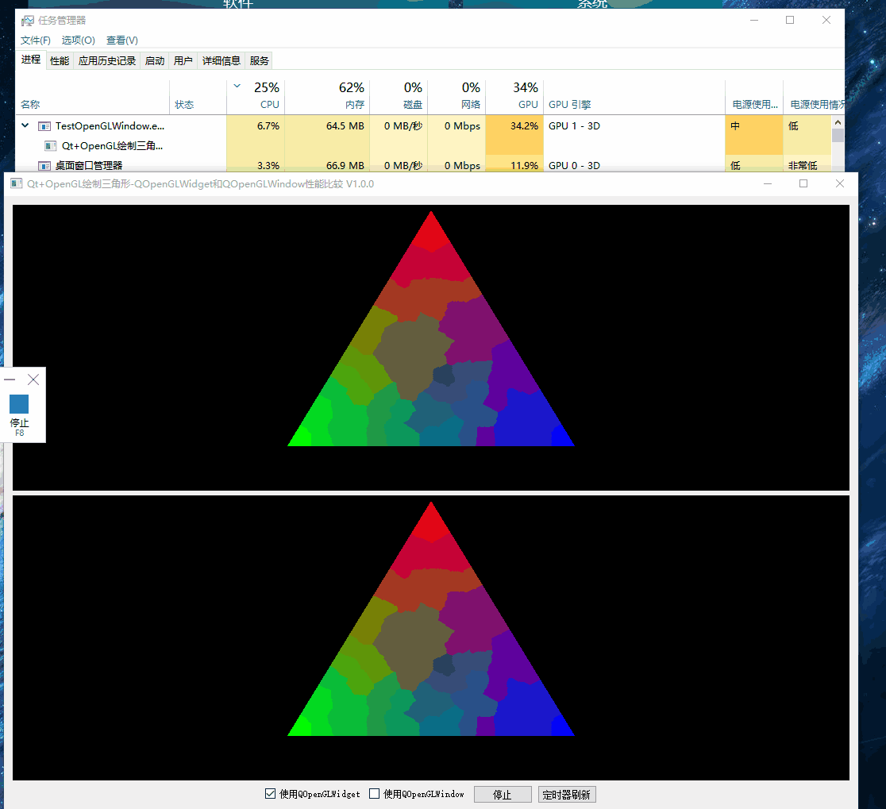

# Qt OpenGL开发Demo

[toc]

---

## 1、说明

|       类名       | 功能                                     |
| :--------------: | ---------------------------------------- |
| TestOpenGLWindow | 测试比较QOpenGLWidget和QOpenGLWindow性能 |

 


## 2、相关博客

|                           相关博客                           |
| :----------------------------------------------------------: |
| 👉[CSDN](https://blog.csdn.net/qq_43627907/category_11724775.html)👈 |


## 3、实现效果

### 1.1 TestOpenGLWindow

> 1. 使用OpenGl 1.0 API绘制三角形（实现简单，已经淘汰的API）;
> 2. 使用自定义Shader脚本绘制三角形（实现较为复杂）；
> 3. 分别使用QOpenGLWindow和QOpenGLWidget绘制三角形；
> 4. 分别使用定时器、子线程刷新绘制；
> 5. Qt官方说QOpenGLWindow性能比QOpenGLWidget强，具体强不强，强多少要比过才知道，通过比较，QOpenGLWindow性能确实比QOpenGLWidget强。

* **以下的测试方式并不全面，只代表个人观点。**

* **测试1：**使用定时器刷新绘制，由于定时器是在UI线程执行，如果当前还没执行完就会阻塞住，从测试线性可以看出

  * 单独使用定时器刷新QOpenGLWidget绘制会很慢；

  * 单独使用定时器刷新QOpenGLWindow绘制会很快；

  * 如果使用定时器同时刷新QOpenGLWidget和QOpenGLWindow，会发现QOpenGLWindow也会被拖慢。

    

* **测试二：** 使用子线程刷新绘制；

  * 单独使用子线程刷新QOpenGLWidget可以看出CPU占用率为10.3%，GPU占用率为：30.3%；
  * 单独使用子线程刷新QOpenGLWindow可以看出CPU占用率为：7.9%，GPU占用率为：24.4%。
  * 并且因为QOpenGLWidget使用子线程刷新速度过快，可能出现残缺的情况。

  

* **测试三：** 分别使用定时器刷新绘制QOpenGLWindow和QOpenGLWindow，1毫秒刷新一次，一次转动1度，打印转一圈需要的时间；测试 结果如下：QOpenGLWidget绘制一圈的时间几乎是QOpenGLWindow的十几倍，当然可用设置QOpenGLWidget的交换时间来提高绘制速度，但是这样CPU占用率会大大提升。

  ```cpp
  QOpenGLWidget： 5561
  QOpenGLWidget： 5394
  QOpenGLWidget： 5512
  QOpenGLWidget： 5579
  QOpenGLWindow： 481
  QOpenGLWindow： 448
  QOpenGLWindow： 459
  QOpenGLWindow： 618
  ```

  
