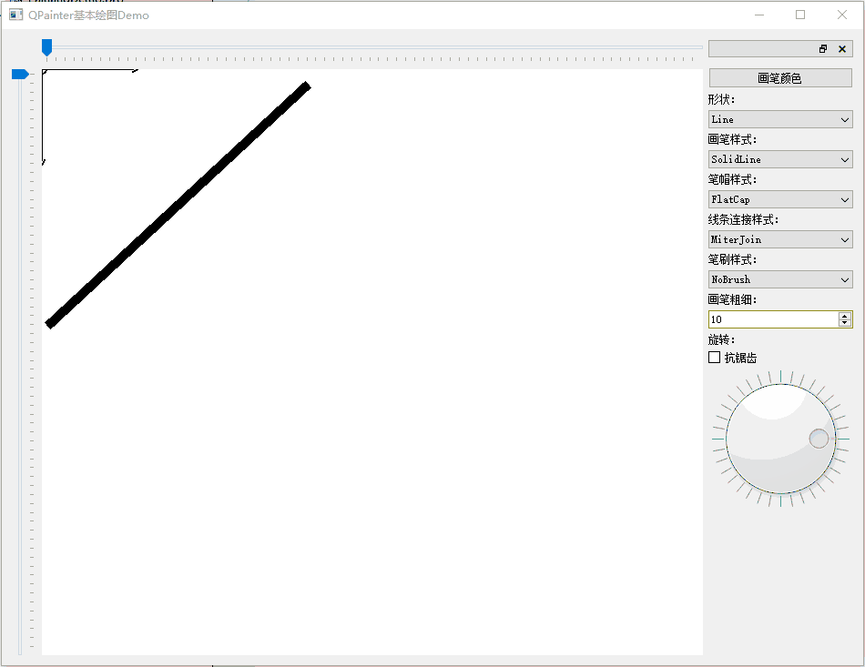
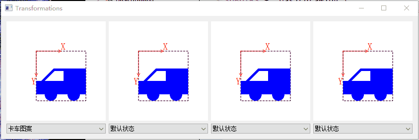
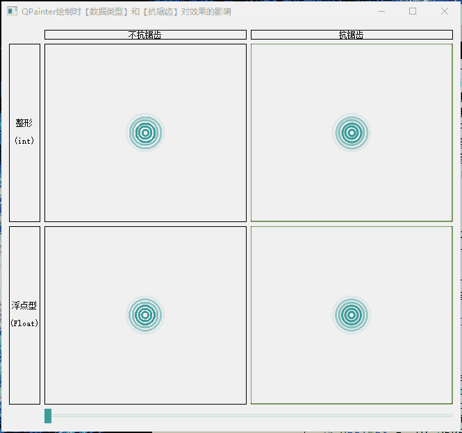
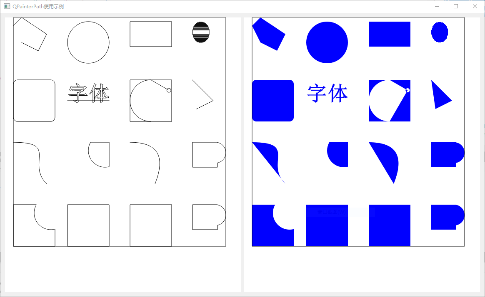
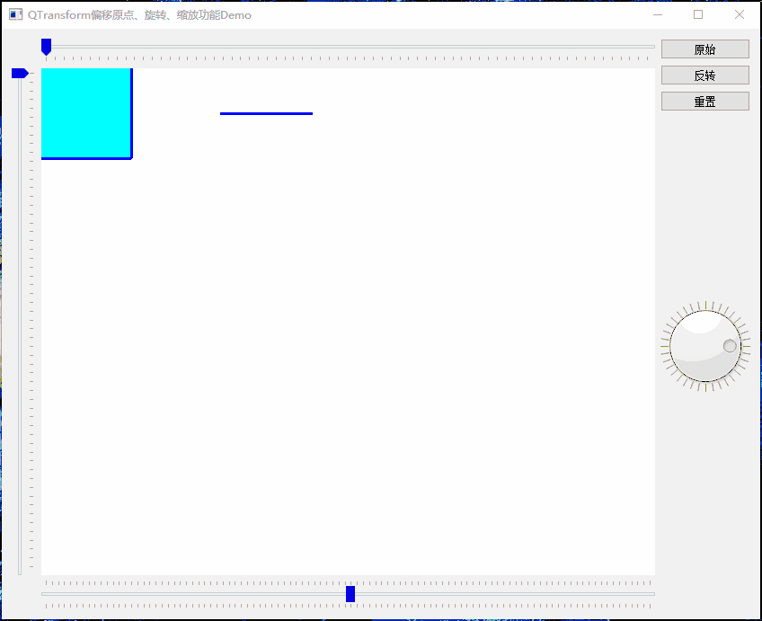

# Qt绘图Demo

[toc]

---

## 1、说明

| 类名              | 功能                                               |
| ----------------- | -------------------------------------------------- |
| basicdrawing      | QPainter基本绘图Demo                               |
| Transformations   | QPainter偏移原点、旋转、缩放功能Demo               |
| Concentriccircles | QPainter绘制时【数据类型】和【抗锯齿】对效果的影响 |
| PainterPaths      | QPainterPath使用示例                               |
| PlayImage         | Qt使用QPainter绘制方式显示图片                     |
| TransformDemo     | QTransform偏移原点、旋转、缩放功能Demo             |

## 2、相关博客

* [CSDN](https://blog.csdn.net/qq_43627907/category_11970609.html)

## 3、实现效果

### 1.1 basicdrawing

> 1. 绘制原点和坐标轴；
> 2. 绘制线段、散点、多线段、多边形、矩形、圆角矩形、椭圆、弧线、弦形、扇形、绘制路径、文字、图片；
> 3. 可设置画笔样式、笔帽样式、线条连接样式、笔刷样式、画笔粗细、颜色、抗锯齿；
> 4. 可设置坐标原点水平、垂直偏移、旋转、缩放。

### 1.2 Transformations

> 1. 使用QPainterPath设置绘制较复杂的图案；
> 2. 演示绘图时偏移坐标轴原点、选择、缩放操作。

### 1.3 Concentriccircles

> 1. 使用浮点数进行绘制，绘制的圆会更加均匀；
> 2. 使用整形进行绘制，比浮点数计算快，适用于频繁、大量的重绘，但绘制效果较差；
> 3. 开启抗锯齿后线条会更加平滑;
> 4. 将布局改为使用设计器布局，减少使用代码布局，使关注点更多在绘制图形上；
> 5. 将使用定时器更新绘制改为使用滑动条更新，增加可控性，便于观察绘制细节。

### 1.4 PainterPaths

> 1. QPainterPath使用示例，包含QPainterPath中所有函数的使用方式；
> 2. 采用绘制轮廓和填充两种方式进行绘制，更便于观察效果。

### 1.5 PlayImage

> 1. 使用QPainter绘制方式显示图片；
> 2. 支持传入QPixmap、QImage两种格式；
> 3. 以50Hz频率同时显示64路图片没有压力；
> 4. 使用简单，没有第三方依赖，使用与所有平台、任意编译器；

* **演示**
  * 由于GIF录制频率比较低，所以看起来有点卡。

### 1.7 TransformDemo

> * 在QPainter绘图时使用QTransform类进行偏移、缩放、旋转等操作；
> * 通过QTransform对绘制的图元进行映射。

