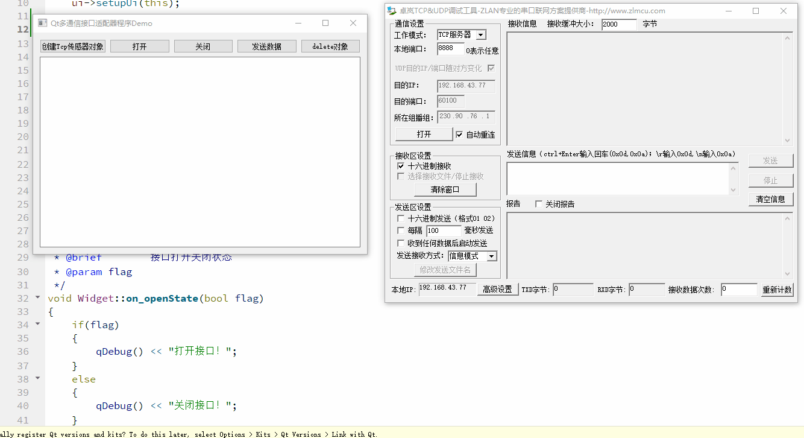

## 1、说明

|      模块名       | 功能                       |
| :---------------: | -------------------------- |
| DeviceControlDemo | Qt多通信接口适配器程序Demo |

## 2、模块详细说明

### 1.1 DeviceControlDemo

* 当软件需要和多个设备(例如传感器)进行通信时，而每个设备的通信方式又不一样**（例如：TCP、UDP、串口）**，这时就可以使用多态；
* 定义一个通信接口基类，统一管理所有的通信方式，同时定义一个数据解析基类，可支持创建线程解析数据；
* 每一个设备通信类可选择在内部通过继承数据处理基类封装一个数据处理类；
* 数据处理类在**内部封装了子线程创建、销毁逻辑**，使用这种封装方式的优势就是不需要每次创建一个对象都要单独再创建一个QThread，再通过moveToThread将对象移入线程，然后再写退出代码，因为**封装在类的内部**，在创建一个数据处理类时就自动创建一个线程，使用起来十分简单。

| 类名            | 功能                                |
| --------------- | ----------------------------------- |
| AbstractSensor  | 定义一个设备通信接口基类            |
| AbstractThread  | 定义一个处理接收到的数据的线程基类  |
| handleTcpThread | 处理Tcp设备接口接收到的数据的线程类 |
| TcpSensor       | 使用Tcp通信的设备交互类             |

