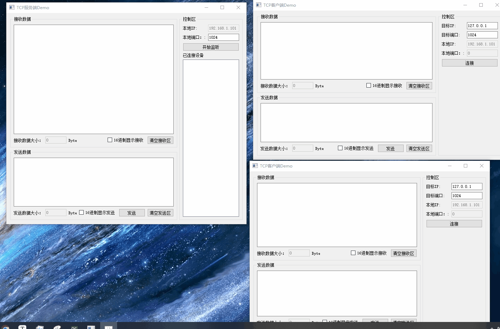
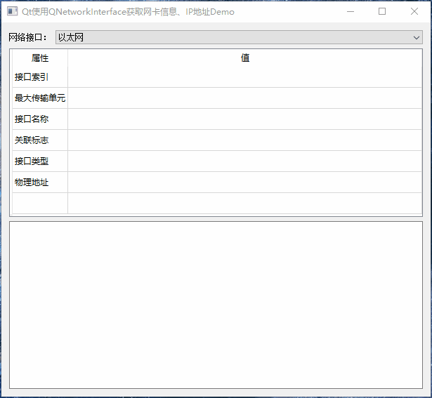

# Qt网络编程Demo说明及演示

[toc]

## 1、说明

|      工程       | 功能                                                         |
| :-------------: | ------------------------------------------------------------ |
| SimpleNetWidget | Qt实现简易版网络通信Demo                                     |
|    NetWidget    | Qt实现网络通信Demo，相对于SimpleNetWidget要复杂一些，但功能更完善 |
|   NetProperty   | Qt使用QNetworkInterface类获取当前系统的所有网络接口（网卡）信息 |

 

## 2、相关博客

|                           相关博客                           |
| :----------------------------------------------------------: |
| 👉[CSDN](https://blog.csdn.net/qq_43627907/category_11763319.html)👈 |

## 3、 实现效果

### 1 SimpleNetWidget

* 简易版网络通信Demo，便于小白学习使用，尽可能少的功能，尽可能简单，所以可能存在一些bug；

#### 1.1 SimpleTcpClient

> 简易版TCP 客户端Demo
>
> * 只保留了TCP连接/断开、数据发送、数据接收功能

#### 1.2  SimpleTcpServer

> 简易版TCP 服务端Demo
>
> * 只保留了TCP监听连接/断开功能、数据发送、数据接收功能

#### 1.3 SimpleUdpSocket1

> 简易版UDP单播通信Demo
>
> - 使用传统UDP通信步骤实现UDP单播通信；

#### 1.4 SimpleUdpSocket2

> 简易版UDP单播通信Demo
>
> - 使用类TCP的UDP通信步骤实现UDP单播通信;

#### 1.5 SimpleUdpGroup

> 简易版UDP组播通信Demo
>
> - 支持同一系统中打开多个窗口绑定同一个端口号进行通信。
> - 实现多窗口数据发送、接收功能。

### 3 NetWidget

* 相对于SimpleNetWidget要复杂一些，但也比较简单。

#### 1.1 TcpClient

  > * 支持打开多个TCP Client窗口；👍
  > * 可选择是否以16进制字符串形式显示发送、接收的数据；👍
  > * 自动统计发送数据的总字节大小、接收数据的总字节大小；👌
  > * 判断TCP Socket状态变化；✌️ 
  > * 判断TCP Socket各类异常状态；✋
  > * 详细说明close、disconnectFromHost、abort三种断开连接的方式和优缺点； 👐
  > * 代码注释详细，便于学习阅读。 👇

#### 1.2 TcpServer

> * 支持打开多个TCP Server窗口；👍
> * 支持**同时连接多个**TcpClient，将连接的TcpClient添加进通信列表；
> * 支持**自动移除**通信列表中断开连接的TcpClient；
> * 支持**一对多**进行数据通信，或通过在连接TcpClient列表中勾选需要通信的对象进行数据通信；
> * 支持频繁断开连接大量的QTcpSocket并不存在内存泄漏；
> * 可选择是否以16进制字符串形式显示发送、接收的数据；👍
> * 自动统计发送数据的总字节大小、接收数据的总字节大小；👌
> * 判断TCP Socket状态变化；✌️ 
> * 判断TCP Server各类异常状态；✋
> * 详细说明close、disconnectFromHost、abort三种断开连接的方式和优缺点； 👐
> * 代码注释详细，便于学习阅读。 👇
> *  注意：如果程序需要频繁断开连接，那就需要考虑内存泄漏问题
>   * QTcpServer存在一些内存泄漏问题，如果没有通过nextPendingConnection返回所有的的QTcpSocket并释放，将只有在QTcpServer释放时才会统一释放已连接的QTcpSocket；
>   * 如果程序需要频繁断开连接，解决这个内存泄漏问题就需要通过hasPendingConnections函数判断是否有未返回的已连接QTcpSocket，如果有就调用nextPendingConnection返回并释放。

### 4 NetProperty

> Qt使用QNetworkInterface类获取当前系统的所有网络接口（网卡）信息，包括：
>
> * 切换所有网络接口；
> * 网络接口索引；
> * 网络接口最大传输数据单元；
> * 网络接口名称；
> * 网络接口关联标志；
> * 网络接口类型说明；
> * 网络接口物理地址；
> * IPv6地址、子网掩码
> * IPv4地址、子网掩码、广播地址。

