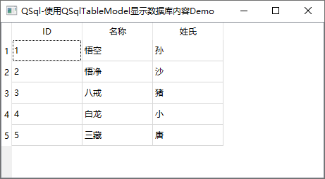
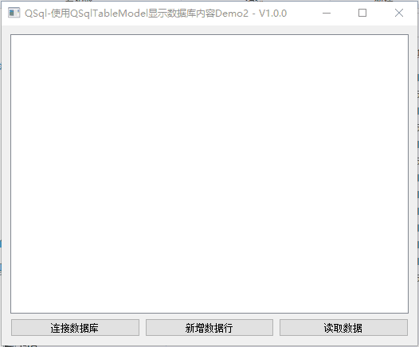
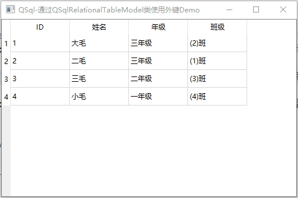
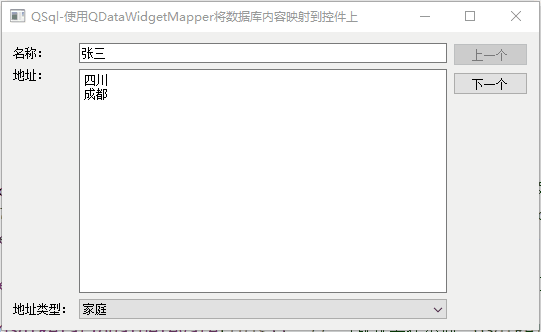
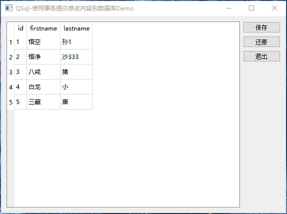
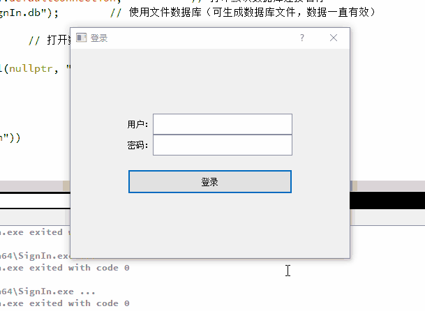

# Qt使用QtSql模块操作数据库Demo说明及演示

[toc]

## 1、说明

|         工程         | 功能                                                         |
| :------------------: | ------------------------------------------------------------ |
|      TableModel      | 展示了使用QSqlTableModel来显示数据库信息                     |
|     TableModel2      | 在TableModel的基础上实现创建空白数据行、自增key              |
| RelationalTableModel | 展示了使用QSqlRelationalTableModel来使用数据库[外键]         |
|   SqlWidgetMapper    | 将数据库内容通过QDataWidgetMapper将模型数据映射到小部件      |
|     CachedTable      | 通过QSqlTableModel显示和修改数据，通过按键保存修改内容和恢复修改内容 |
|        SignIn        | 使用QSqlite数据库实现用户登录、后台管理用户功能              |

 

## 2、相关博客

|                           相关博客                           |
| :----------------------------------------------------------: |
| 👉[CSDN](https://blog.csdn.net/qq_43627907/category_11804042.html)👈 |

## 3、实现效果

### 1.1 TableModel

### 1.2 TableModel2

> 这个Demo中展示了如何使用具有表视图的专用 SQL 表模型（QSqlTableModel）来编辑数据库中的信息    
>   1、通过按键新建 空白数据行；                                           
>   2、使用自增Key；                                              
>   3、通过按键更新数据；                                               
>   4、判断表是否存在，不存在则创建。                                     

### 1.2 RelationalTableModel

### 1.3 SqlWidgetMapper

### 1.4 CachedTable

### 1.5 SignIn

> 使用QSqlite数据库实现用户登录、后台管理用户功能         
>   1、通过按键新建 空白数据行；                   
>   2、使用自增Key；                        
>   3、通过按键更新数据；                       
>   4、判断表是否存在，不存在则创建。                 
>   5、用户登录功能，默认创建超级管理员账号root          
>   6、支持用户后台管理，通过后台创建、修改、删除用户         
>   7、用户分为超级管理员、普通管理员、普通用户三个等级；       
>   8、超级管理员有所有权限，可创建、修改、删除普通管理员、普通用户； 
>   9、普通管理员可创建、修改、删除普通用户，可新建、修改、查询数据； 
>   10、普通用户不可修改用户信息，不可新建、修改数据库信息，只可查询。

