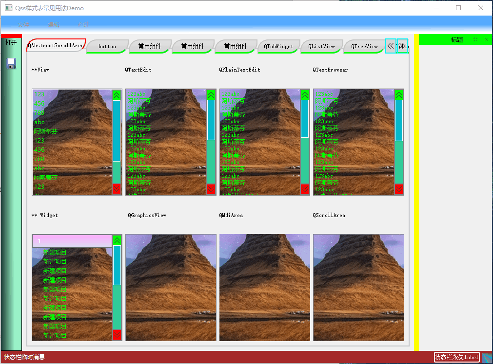
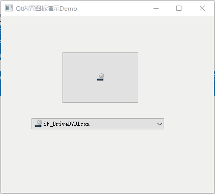
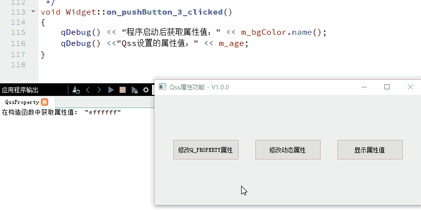

# Qt样式美化设置Demo说明及演示

[toc]

## 1、说明

| 工程        | 功能                     |
| ----------- | ------------------------ |
| QssDemo     | 常见的组件基本QSS样式表  |
| IconDemo    | Qt使用QStyle内置图标Demo |
| QssProperty | QSS样式表使用---属性功能 |

## 2、相关博客

|                           相关博客                           |
| :----------------------------------------------------------: |
| 👉[CSDN](https://blog.csdn.net/qq_43627907/category_11906121.html)👈 |
| 👉[IConDemo👈](https://blog.csdn.net/qq_43627907/article/details/125229943) |

## 3、实现效果

### 1.1 QssDemo

> * 十分详细的Qss样式表练习Demo，为了效果明显有些样式进行了夸张，所以不一定好看;
> * 包含了常用控件的Qss样式；

### 1.2 IconDemo

> * 通过`QStyle::StandardPixmap`枚举使用Qt内置的图标;

### 1.3 QssProperty

> * Qss内置了许多的伪状态可以用于设置控件的样式动态变化（例如：`:checked`、`:hover`），但在日常开发中为了更加灵活的样式，这些伪状态就不够用了；
> * 将QObject中的属性功能与Qss结合使用就会发现不一样的风景，主要有4种用法；
>   1. 使用**Qss属性选择器**设置通过【Q_PROPERTY】定义的属性的样式，当属性状态改变后控件样式跟着改变；
>   2. 使用**Qss属性选择器**设置通过【setProperty()】定义的动态属性的样式，当属性状态改变后控件样式跟着改变；
>   3. 使用 【qproperty-<属性名称>】语法设置通过Q_PROPERTY定义的属性的值；
>   4. 定义一个枚举，使用Q_ENUM或者Q_ENUMS注册枚举类型，使用Q_PROPERTY定义一个已注册的枚举类型的属性，可以通过【qproperty-<属性名称>：枚举名称】方式设置属性的值。
> * 在代码中不再是将样式表放在资源文件中，而是放到可执行程序路径下，可定制性更强。

