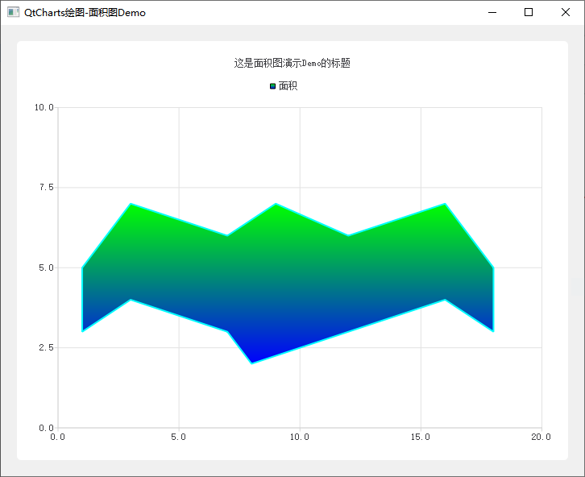
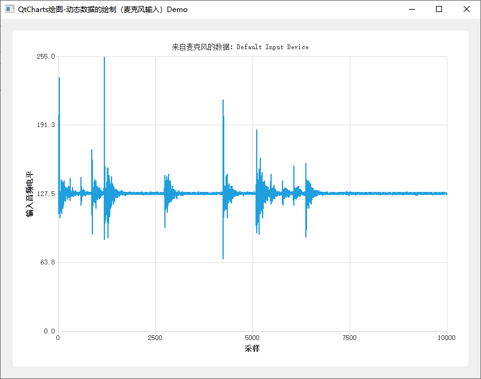

# Qt使用QtCharts模块绘制图表Demo说明及演示

[toc]

## 1、说明

| 工程      | 功能                                       |
| --------- | ------------------------------------------ |
| AreaChart | 该示例显示了如何创建简单的面积图           |
| Audio     | 这个例子显示了动态数据的绘制（麦克风输入） |

## 2、实现效果

### 1.1 AreaChart

### 1.2 Audio

