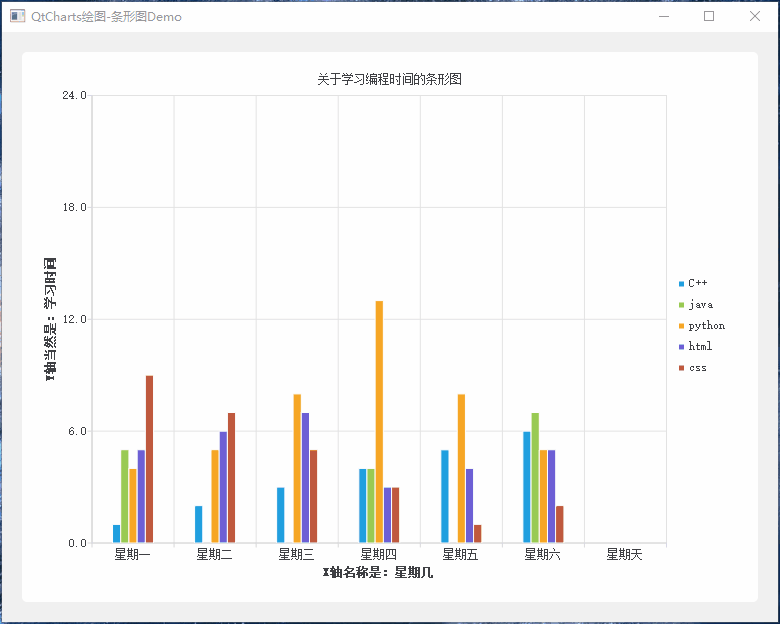
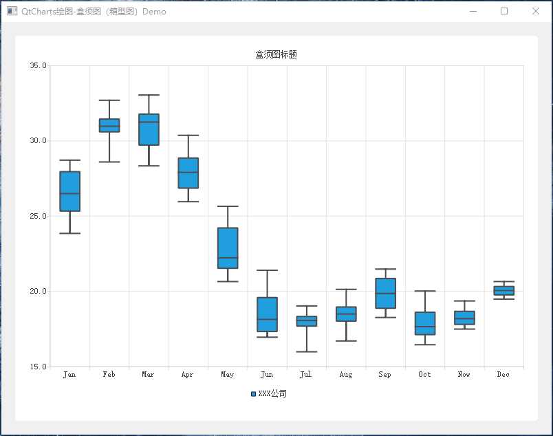
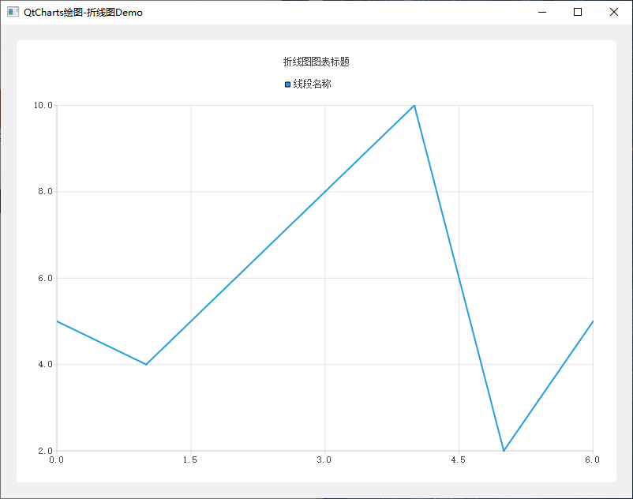
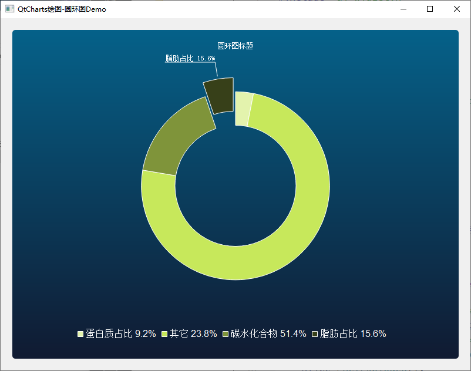
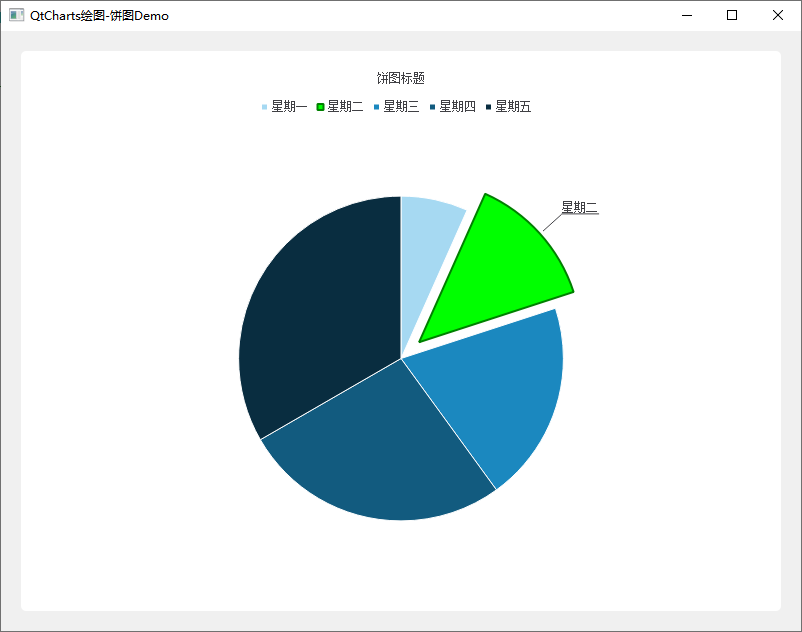
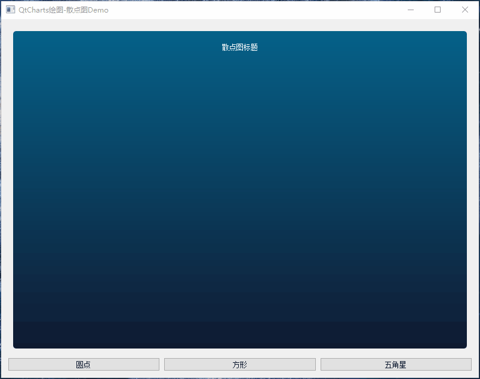
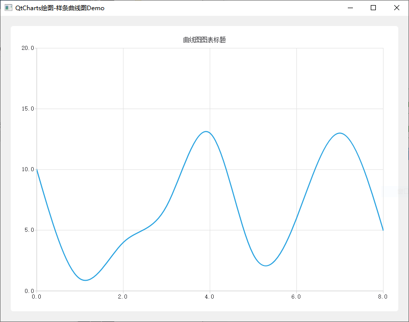
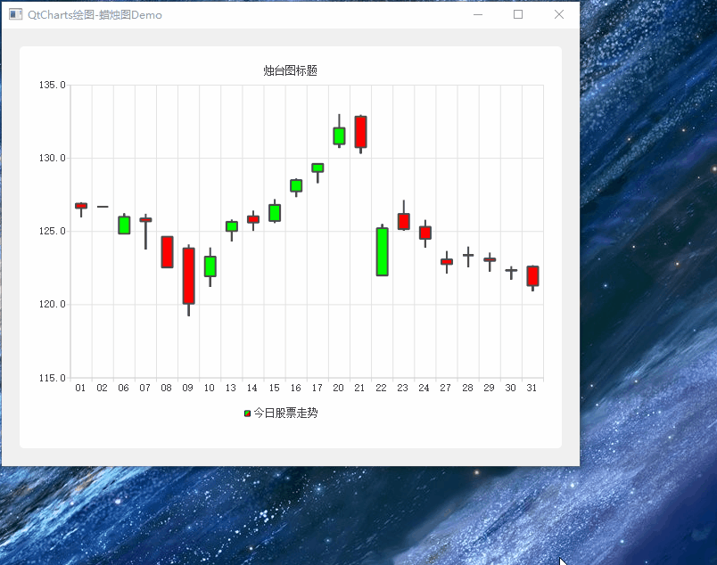

# Qt使用QtCharts模块绘制图表Demo说明及演示

[toc]

## 1、说明

| 工程             | 功能                                                     |
| ---------------- | -------------------------------------------------------- |
| AreaChart        | 该示例显示了如何创建简单的面积图                         |
| Audio            | 这个例子显示了动态数据的绘制（麦克风输入）               |
| BarChart         | 该示例显示了如何创建条形图                               |
| BoxPlotChart     | 该示例显示了如何创建盒须图（箱形图）                     |
| CandlestickChart | 显示如何创建烛台图表                                     |
| DonutChart       | 这个例子展示了如何创建一个简单的圆环图                   |
| LineChart        | 该示例展示了如何创建一个简单的折线图                     |
| PieChart         | 该示例演示如何创建简单的饼图，并对饼图切片进行一些自定义 |
| ScatterChart     | 这个例子展示了如何创建一个简单的散点图                   |
| SplineChart      | 该示例演示了如何创建简单的样条曲线图                     |

## 2、实现效果

### 1.1 AreaChart

### 1.2 Audio

### 1.3 BarChart

### 1.4 BoxPlotChart

### 1.5  LineChart

### 1.6 DonutChart

### 1.7 PieChart

### 1.8 ScatterChart

### 1.9 SplineChart

### 1.10 CandlestickChart

