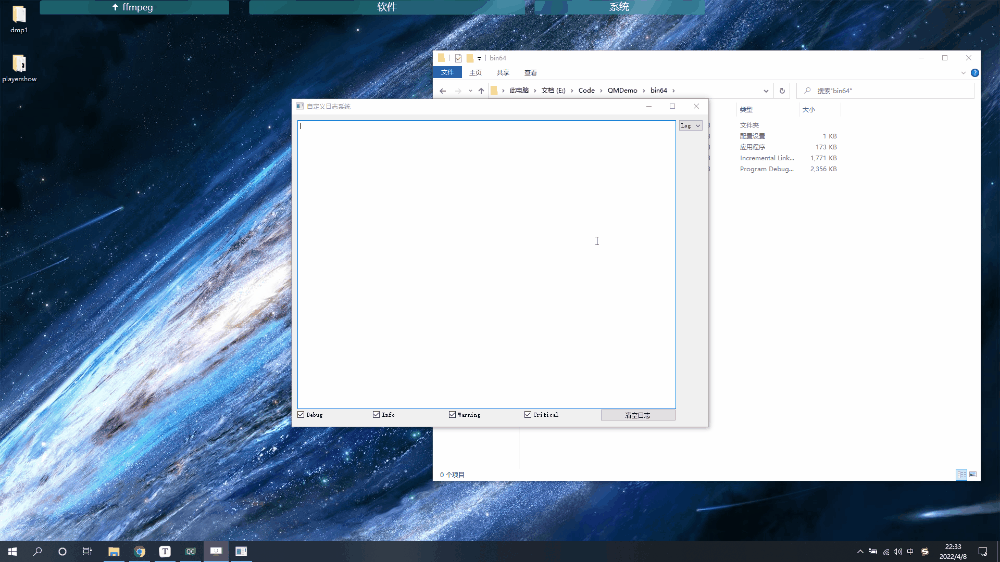

# QMDemo
Qt常用功能Demo

---

[toc]

---

## 1、说明

| 模块名           | 功能                               | 支持系统                |
| ---------------- | ---------------------------------- | ----------------------- |
| QMWidget         | 基于QWidget实现的自定义窗口模块    | windows                 |
| DeviceManagement | 串口、鼠标、键盘热插拔监测功能模块 | windows                 |
| QLog             | Qt日志系统                         | windows、linux、*mac*OS |

## 2、模块示例

### 2.1 QMWidget

* **实现功能**

  * 鼠标在标题栏移动窗口
  * 双击标题栏最大化、还原
  * 窗口移动到屏幕边界实现1/4屏、1/2屏、全屏显示
  * 最大化、最小化、退出按键
  * 鼠标在窗口边缘，四角拉伸缩放窗口
  * 任务栏标题名称设置
  * 独立标题栏模块，便于后续扩展

* **演示**

  

### 2.2 DeviceManagement

* **实现功能**

  * 通过继承**QAbstractNativeEventFilter**接口实现串口热插拔监测功能；
  * 通过在QWidget中重写**nativeEvent**实现串口热插拔监测功能；
  * 通过一个函数获取系统中所有可用串口名；
  * 自动添加、移除可用串口；
  * 鼠标、键盘热插拔监测。

* **演示**

  

  

### 2.3 QLog

* **实现功能**

  * 可选择日志显示到文本窗口并保存、不显示只保存两种使用方式；
  * 选择显示日志级别；
  * 可设置不同级别日志显示颜色；
  * 将日志信息保存到txt文本；
  * 支持按12小时、24小时、按文件大小、日志行数创建新日志文件；
  * 无任何第三方依赖，支持任意编译器，任意系统；
  * 保留日志存储接口、日志显示接口，便于后续扩展日志存储、显示方式，如存储到数据库等。

* **演示**

  
