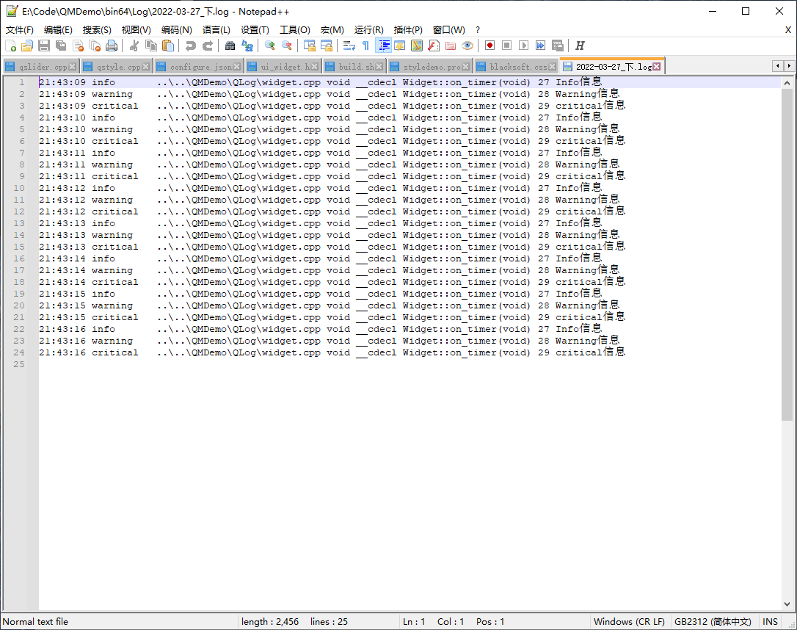
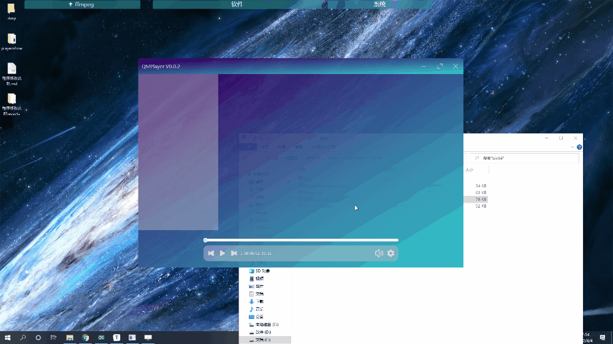
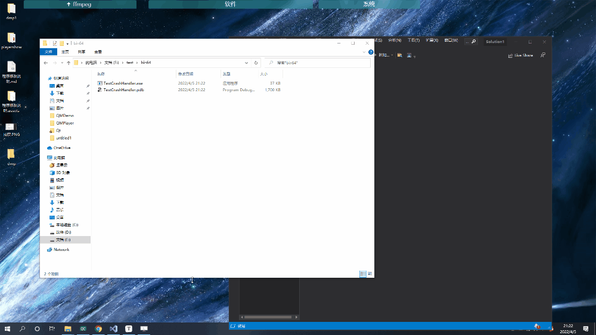
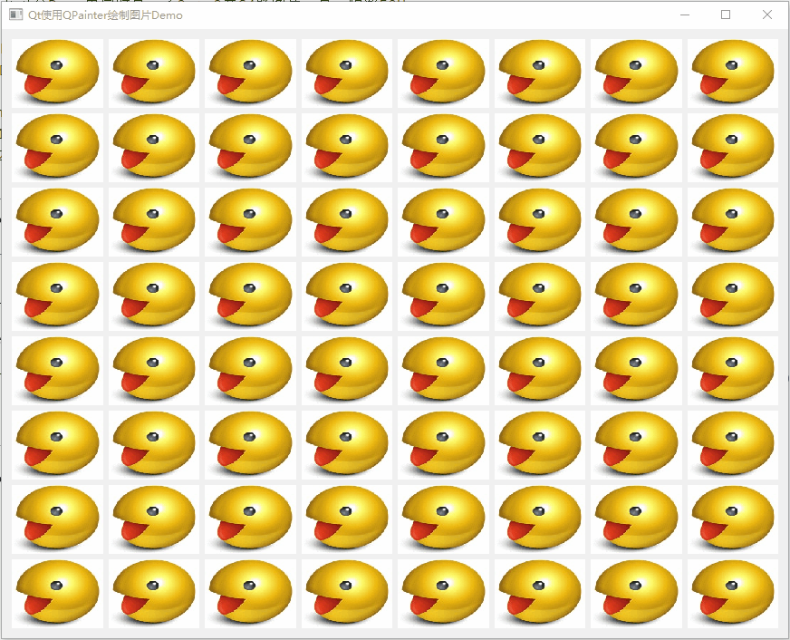

在这个仓库中收录了一些自己练习Qt用的Demo和日常开发中经常用到的功能模块。

<table><tr><td bgcolor=#FFFF00>所有内容为我学习、工作过程中产生，并算不上优秀，仅作参考</td></tr></table>

# 一、说明

| 模块名           | 功能                                                         | 支持系统 |
| ---------------- | ------------------------------------------------------------ | -------- |
| QMWidget         | 基于QWidget实现的自定义窗口模块                              | windows  |
| DeviceManagement | 串口、鼠标、键盘热插拔监测功能模块                           | windows  |
| QLog             | Qt日志系统                                                   |          |
| QMPlayer         | 视频播放器界面                                               | windows  |
| TestCrashHandler | windows下程序崩溃定位Demo                                    | windows  |
| QMNetwork        | [Qt网络编程Demo](./QMNetwork/QMNetwork.md)                   |          |
| XlsxDemo         | [Qt使用QXlsx操作Excel Demo](./XlsxDemo/XlsxDemo.md)          |          |
| QtChartsDemo     | [Qt使用QtCharts模块绘制图表Demo](./QtChartsDemo/QtCharts.md) |          |
| PlayImage        | Qt使用QPainter绘制方式显示图片                               |          |
| ProgramFramework | [用过的一些Qt程序模块设计架构Demo](./ProgramFramework/ProgramFramework.md) |          |
| QSqlDemo         | [QSql学习Demo](./QSqlDemo/QSql.md)                           |          |
| QStyleDemo       | [Qt样式美化设置Demo说明及演示](./QStyleDemo/QStyleDemo.md)   |          |

# 二、模块详细说明

## 1、 QMWidget

* **介绍**

  * 鼠标在标题栏移动窗口
  * 双击标题栏最大化、还原
  * 窗口移动到屏幕边界实现1/4屏、1/2屏、全屏显示
  * 最大化、最小化、退出按键
  * 鼠标在窗口边缘，四角拉伸缩放窗口
  * 任务栏标题名称设置
  * 独立标题栏模块，便于后续扩展

* **演示**

  

## 2、 DeviceManagement

* **介绍**

  * 通过继承**QAbstractNativeEventFilter**接口实现串口热插拔监测功能；
  * 通过在QWidget中重写**nativeEvent**实现串口热插拔监测功能；
  * 通过一个函数获取系统中所有可用串口名；
  * 自动添加、移除可用串口；
  * 鼠标、键盘热插拔监测。

* **演示**

  

  

## 3、 QLog

* **介绍**

  * 可选择日志显示到文本窗口并保存、不显示只保存两种使用方式；
  * 选择显示日志级别；
  * 可设置不同级别日志显示颜色；
  * 支持将日志信息保存到纯文本Log文件中；
  * 支持将日志信息保存到纯文本CSV文件中，便于阅读、查找和分类日志信息，可用于将CSV中的日志信息导入数据库；
  * 支持按12小时、24小时、按文件大小、日志行数创建新日志文件；
  * 无任何第三方依赖，支持任意编译器，任意系统；
  * 保留日志存储接口、日志显示接口，便于后续扩展日志存储、显示方式，如存储到数据库等；
  * 模块完全基于QDebug，与程序所有功能基本0耦合，非常便于程序开发。

* **演示**

  

## 4、 QMPlayer

Qt实现的视频播放器界面Demo。

* **介绍**
  * 基于QMWidget的自定义窗口；
  * 增加侧边栏模块；
  * 增加播放控制栏模块，包含播放停止、上一集、下一集、视频时间、音量控制、设置功能按键样式；
  * 增加进度条模块，可跳转到鼠标点击位置；
  * 通过`QPropertyAnimation`实现侧边栏、进度条、控制栏打开关闭动画效果；
  * 实现双击全屏显示、还原效果。
* **演示**

## 5、 TestCrashHandler

* **介绍：**

  * 通过win api实现qt程序崩溃问题定位功能；

  * 只支持**msvc编译器**；

  * 低耦合模块，**一行代码**直接引用功能，无需添加第三方依赖库；

  * 根据时间生成dump文件，每次崩溃生成一个文件，避免了覆盖问题；

  * 程序崩溃时自动生成dmp文件，可通过WinDbg或VS打开dmp文件定位崩溃位置；

  * 通过宏判断，在MinGW或其他系统环境编译时功能自动失效**不会编译失败**；

  * 支持release模块下生成dump文件。

* **演示：**

## 6、PlayImage

* **介绍**
  * 使用QPainter绘制方式显示图片；
  * 支持传入QPixmap、QImage两种格式；
  * 以50Hz频率同时显示64路图片没有压力；
  * 使用简单，没有第三方依赖，使用与所有平台、任意编译器；
* **演示**
  * 由于GIF录制频率比较低，所以看起来有点卡。

