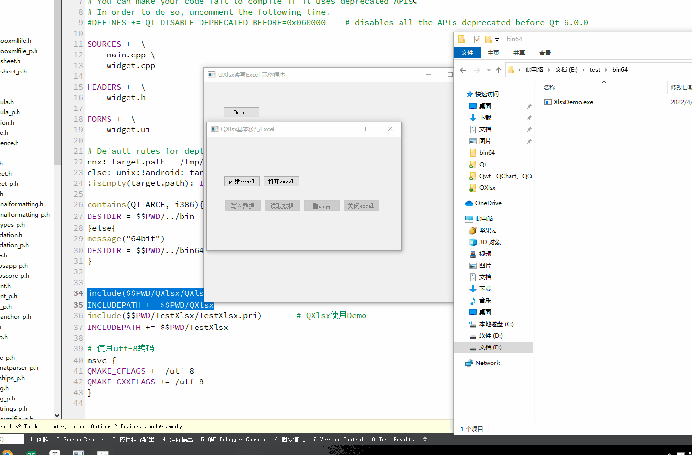
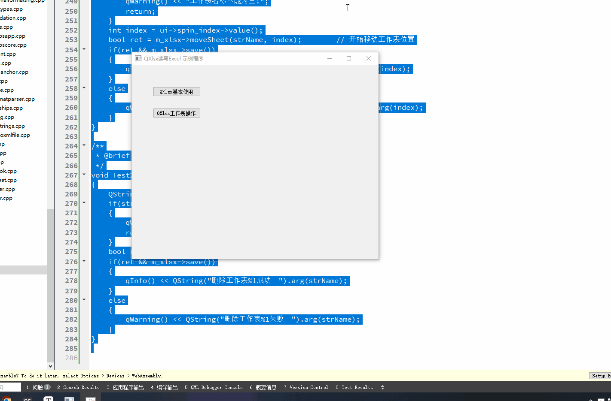
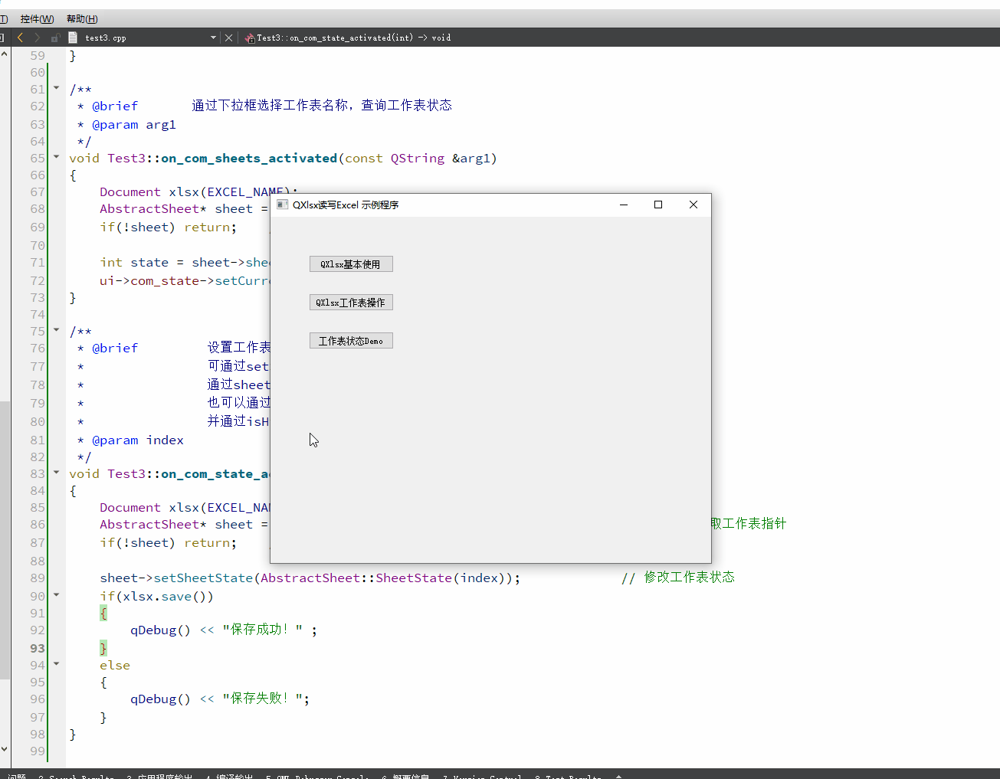
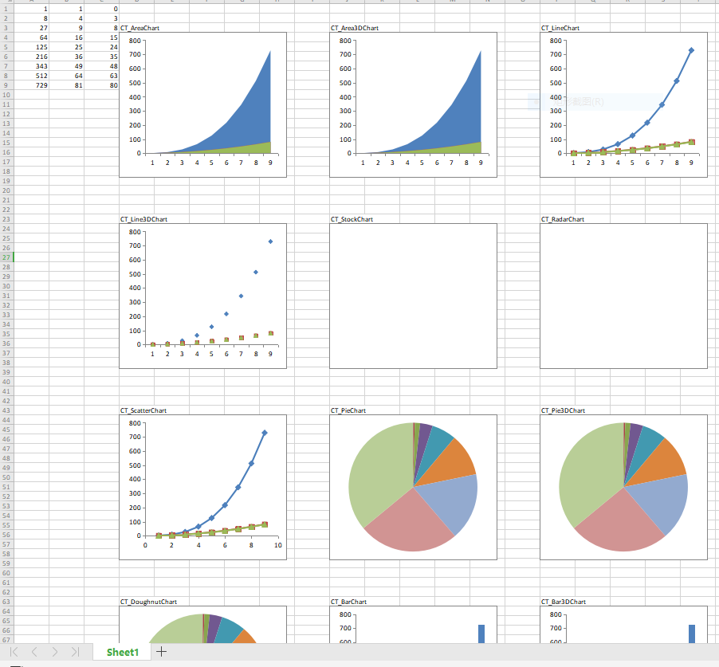
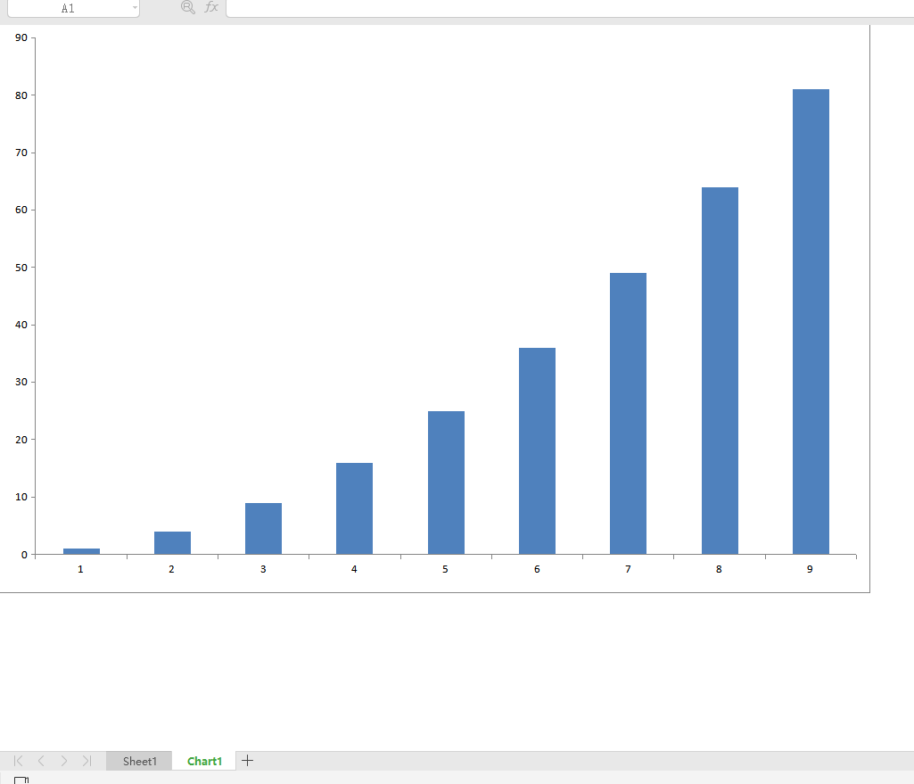
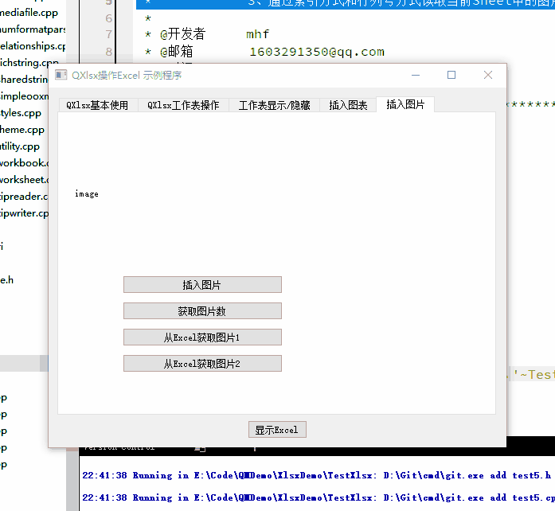
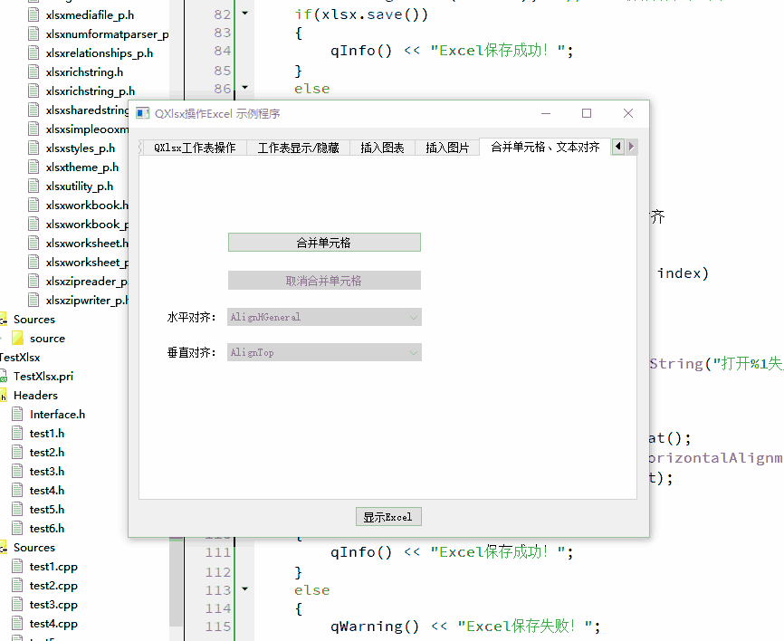
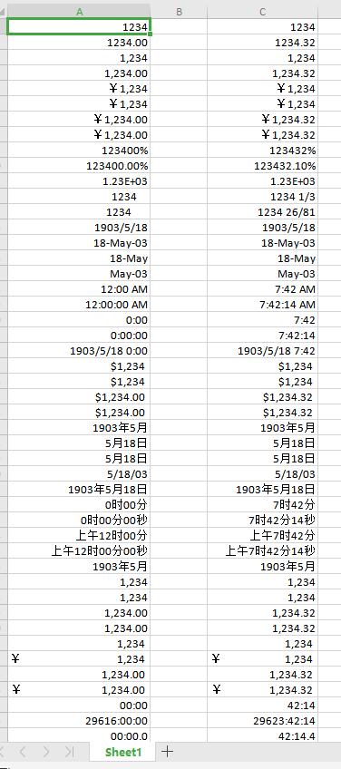
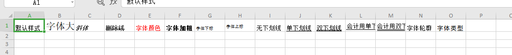

# Qt使用QXlsx库操作Excel Demo说明及演示

[toc]

## 1、说明

| 类名  | 功能                                                         |
| :---: | ------------------------------------------------------------ |
| Test1 | QXlsx基本功能使用，创建Excel、打开Excel、写入数据、读取数据、Excel另存为、关闭Excel |
| Test2 | QXlsx操作工作表（Sheet）Demo，包括新建、插入、查询、移动、重命名、复制、删除等 |
| Test3 | 查询设置工作表（Sheet）可见/隐藏状态                         |
| Test4 | Qxlsx插入图表功能演示                                        |
| Test5 | Excel中插入、读取图片                                        |
| Test6 | QXlsx合并单元格、文本对齐                                    |
| Test7 | QXlsx设置字体格式、样式                                      |

 

## 2、相关博客

|                           相关博客                           |
| :----------------------------------------------------------: |
| 👉[CSDN](https://blog.csdn.net/qq_43627907/category_11756312.html)👈 |

## 3、实现效果

### 1.1 Test1

> 1. 创建一个新的Excel，并具有一个默认的Sheet；
> 2. 打开Excel文件，并判断是否打开成功；
> 3. 分别使用单元格引用和行列号两种方式将数据写入Excel；
> 4. 分别使用单元格引用和行列行两种方式读取Excel所有数据；
> 5. 将Excel数据另存为2.xlsx；
> 6. 释放Excel数据。

### 1.2 Test2

> 1. 查询打开的Excel中所有可用的工作表（Sheet）名称；
> 2. 创建指定名称的工作表（Sheet），自动添加到最末尾，支持ST_WorkSheet、ST_ChartSheet两种类型；
> 3. 在指定位置插入一个新的指定名称的工作表（Sheet），支持ST_WorkSheet、ST_ChartSheet两种类型；
> 4. 将某个工作表（Sheet）设置为当前活动工作表，并写入数据（ST_WorkSheet类型）；
> 5. 将指定名称的工作表（Sheet）重命名为一个新的名称，不改变其它因素；
> 6. 将指定名称的工作表（Sheet）拷贝为一个新的指定名称的工作表，两个工作表内容相同；
> 7. 将指定名称的工作表（Sheet）移动到指定位置；
> 8. 删除指定名称的工作表（Sheet）。
> 

### 1.3 Test3

> 1. 创建指定名称的工作表（Sheet），自动添加到最末尾；
> 2. 查询打开的Excel中所有可用的工作表（Sheet）名称；
> 3. 查询选中工作表的状态（显示、隐藏、绝对隐藏）；
> 4. 设置选中工作表的状态（显示、隐藏、绝对隐藏）；
> 5. 一键调用WPS快速打开Excel（为了方便查看效果）。

### 1.4 Test4

> * 插入所有类型的图表
>   1. 插入面积图；
>   2. 插入3D面积图（在WPS中显示存在问题，office没有测试）；
>   3. 插入折线图；
>   4. 插入3D折线图；
>   5. 插入雷达图（貌似还不支持）；
>   6. 插入散点图（在WPS中效果和CT_LineChart一样）；
>   7. 插入饼图；
>   8. 插入3D饼图（这个图表在WPS中样式和CT_PieChart一样，没有表现出3D效果，无法设置三维旋转）；
>   9. 插入圆环图；
>   10. 插入柱状图；
>   11. 插入3D柱状图（在WPS中显示异常，不支持3D柱状图）；
>   12. 插入饼图（CT_OfPieChart还不支持）；
>   13. 插入曲面图（还不支持）；
>   14. 插入3D曲面图（还不支持）；
>   15. 插入气泡图（还不支持）；
> * 工作表插入图表【进阶】
>   1. 设置【图例】位置；
>   2. 设置图表【标题】；
>   3. 打开图表网格线；
>   4. 行列交换标头；
>   5. 设置插入的数据范围是否包含标题；
>   6. 插入图表，引用其它工作表数据。
> * 添加一个图表Sheet，并插入柱状图。

### 1.5 Test5

> 1. 在当前Sheet指定位置插入图片；
> 2. 获取当前Sheet中图片个数；
> 3. 通过索引方式和行列号方式读取当前Sheet中的图片。

### 1.6 Test6

> 1. 通过【单元格引用】直接设置单元格合并；
> 2. 通过【行列号】设置单元格合并；
> 3. 在设置单元格合并时可以设置单元格【格式】，如文本居中对齐；
> 4. 取消单元格合并；
> 5. 在不修改其它内容情况下设置单元格水平对齐；
> 6. 在不修改其它内容情况下设置单元格垂直对齐。

### 1.7 Test7

> 1. 通过索引号设置数字格式
> 2. 设置自定义数字格式
> 3. 设置字体样式（包括：字体大小、斜体、删除线、颜色、加粗、上下标、下划线、轮廓、字体类型）

